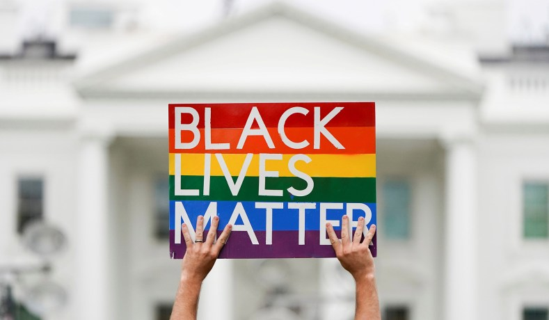

```{r setup, include=FALSE}
knitr::opts_chunk$set(warning = FALSE, message = FALSE)
knitr::opts_chunk$set(echo = FALSE)
```

## Introduction
This year is a special year, the U.S, experienced the unprecedented COVID pandemic, the Black Lives Matter Protest, what’s more, it is also an election year. The winner of an election will shape the U.S. in every way in the next four years. The stake is high. This project is to explore voters’ behavior during 1988 and 2016, specifically, who thought black people are getting less than what they deserved and should have more rights in the society.

```{r load libraries, warning=FALSE, message=FALSE, include=FALSE}
packages.used=as.list(
  c(
  "tidyverse",
  "haven",
  "devtools",
  "RColorBrewer",
  "data.table",
  "ggplot2",
  "egg")
)

check.pkg = function(x){
  if(!require(x, character.only=T)) install.packages(x, 
                                                     character.only=T,
                                                     dependence=T)
}

lapply(packages.used, check.pkg)
```

```{r message=F, include=FALSE, eval=FALSE} 
library(haven)
anes_dat <- read_sav("../data/anes_timeseries_cdf.sav")
```

```{r include=FALSE, echo=FALSE, eval=FALSE}
#narrow down the years
Election_years=as.character(seq(1972, 2016, 4))

#choose variables we are interested in
anes_use <- anes_dat %>% 
  mutate( 
    #demographic
    year = as.factor(VCF0004), 
    race = as_factor(VCF0105a),
    gender = as_factor(VCF0104),
    age = as_factor(VCF0102),
    education = as_factor(VCF0110),
    occupation = as_factor(VCF0115),
    
    #vote or not
    voted_president = as_factor(VCF0706),
    strength_of_pref = as_factor(VCF9022),
 
    #blck
    blck_hard_succeed = as_factor(VCF9039), #conditions make it diff for blcks to succeed
    blck_not_spec = as_factor(VCF9040), #blcks should not have special favors to succeed
    blck_got_less = as_factor(VCF9042), #blcks got less than they deserve over the past few years
    #blck_hardworking_lazy = as_factor(VCF9271),
    blck_influence_politics = as_factor(VCF9275), #blacks have too much, right amount, or too little influence in politics
    aid_to_blck = as_factor(VCF0830), #Aid to Blacks Scale
    blck_hiring = as_factor(VCF0867) #preferential hiring and promotion of blacks?
    ) %>%
  filter(year %in% Election_years) %>% 
  droplevels()

anes_use <- anes_use %>% select(year, race, gender, age, education, occupation, 
                                voted_president, strength_of_pref, 
                                blck_hard_succeed, blck_not_spec, blck_got_less,
                                blck_influence_politics, aid_to_blck, blck_hiring)

anes_use <- anes_use %>% filter(!is.na(voted_president) & !is.na(gender) & !is.na(race)
                                & !is.na(age) & !is.na(aid_to_blck) & !is.na(blck_not_spec)
                                & !is.na(blck_hard_succeed) & !is.na(blck_got_less)) %>%  droplevels()


levels(anes_use$voted_president) <- c("1. Democrat", "2. Republican", "3. Other (incl. 3d/minor party candidates and write-ins)",
                                      "3. Other (incl. 3d/minor party candidates and write-ins)", 
                                      "7. Did not vote or voted but not for president (exc.1972)")

save(anes_use, file="../output/data_use.RData")
```

First, let's do a **history review**, below is the timeline of voting rights in the U.S. check the full version out [here](https://en.wikipedia.org/wiki/Timeline_of_voting_rights_in_the_United_States).

- 1920: Women are guaranteed the right to vote by the Nineteenth Amendment to the United States Constitution. 

- 1965: The Voting Rights Act of 1965. Protection of voter registration and voting for racial minorities, later applied to language minorities. It is considered one of the most far-reaching pieces of civil rights legislation in U.S. history.

- 1971: Adults aged 18 through 21 are granted the right to vote.

Based on the voting rights changes listed above. I select these years' suvery that contain questions we are interested: 1988, 1992, 2000, 2004, 2008, 2012, 2016.

```{r}
load(file = "../output/data_use.RData")
library(DT)
#datatable(anes_use, options = list(pageLength = 5))
```

## General findings
```{r}
cbPalette <- c("#56B4E9", "#D55E00", "#009E73", "#F0E442", "#E69F00", "#0072B2", "#CC79A7", "#F0E449")

df1 <- anes_use %>% 
  select(year, voted_president) %>% 
  group_by(year, voted_president) %>% 
  count(voted_president) %>% 
  group_by(year) %>% 
  mutate(prop = n/sum(n))
  
ggplot(df1, aes(x=year, y=prop, fill=voted_president)) +
  geom_bar(stat='identity')+
  labs(title='Whom did American vote?',
       x='',
       y='',
       fill='')+
  scale_fill_manual(values=cbPalette)+
  geom_text(geom='text', position = 'stack', aes(x=year, y=prop, label=round(prop,2)), size=2)+
  theme_minimal()
```

In general, the differences between Democrat and Republican are not large, except for 2008 (president Obama), the difference was 0.25. Sometimes one party may have a greater number of popular votes, or the total percentage of votes cast for a presidential candidate. The election result doesn’t represent the outcome of the popular vote. One example was the election in 2016, the Democrat had 3% more in popular vote than the Republican’s. Contrary to medias expectations, Republican won the election. That was because of the U.S. system depends on electoral college, instead of the popular vote.

```{r}
df2 <- anes_use %>% 
  select(year, voted_president, race) %>% 
  group_by(year, race) %>% 
  count(voted_president) %>% 
  group_by(year, race) %>% 
  mutate(prop = round(n/sum(n),2))

ggplot(df2, aes(x=year, y=prop, fill=voted_president)) +
  geom_bar(stat='identity')+
  facet_wrap(~race, ncol=1)+
  labs(title='Whom did different racial groups vote?',
       x='',
       y='',
       fill='')+
  scale_fill_manual(values=cbPalette)+
  #geom_text(geom='text', position = 'stack', aes(x=year, y=prop, label=prop,2), size=2)+
  theme_minimal()
```

One interesting finding here was in 2012. Most of black people voted for Democrat (Obama). In the same year, white people tend to vote for Republican. Both of these percentages were very close, but still there was a higher percentage for white people who voted for the Republican. For other races, the percentage of population voted for Democrat was higher than Republican in general.

Another interesting finding was in 2016, for all races except White, there was higher percentage of the population voted for Democrat rather than Republican.


## Who cares about black people's rights?
### variables chosen to measure if a voter believe black people should have more rights:
+ Conditions Make it Difficult for Blacks to Succeed?

+ Blacks Should Not Have Special Favors to Succeed?

+ Blacks Gotten Less than They Deserve Over the Past Few Years?
  1. Agree strongly
  2. Agree somewhat
  3. Neither agree nor disagree
  4. Disagree somewhat
  5. Disagree strongly
  8. DK
  
+ Aid to Blacks Scale
  1. Government should help minority groups/blacks
  2. 
  3.
  4.
  5.
  6.
  7. Minority groups/ blacks should help themselves
  9. DK; haven't thought much about it
  0. NA; telephone IW (2000); no Post IW INAP. question not used
  
+ In American politics, do blacks have too much, about the right amount of, or too little influence?
  1. Too much influence
  2. Just about the right amount
  3. Too little influence
  8. DK
  9. RF; NA; no post data INAP. Inap. question not used

+ Are you for or against preferential hiring and promotion of blacks?
  1. For
  5. Against
  8. DK; 1990-1994: refused; 1996 and later: other
  9. NA; Form A (1986); form B (1990); no Post IW INAP. question not used

### The survey respondents' demographic
```{r message=FALSE, warning=FALSE}
df3 <- anes_use %>% 
  select(year, race, gender, age, education, occupation) %>% 
  group_by(year) %>% 
  count(race) %>% 
  mutate(prop = round(n/sum(n),2))

ggplot(df3, aes(x=year, y=prop, fill=race)) +
  geom_bar(stat='identity')+
  labs(title='Races of people who voted over years',
       x='',
       y='',
       fill='')+
  scale_fill_manual(values=cbPalette)+
  theme_minimal()

df4 <- anes_use %>% 
  select(year, gender, age, education, occupation) %>% 
  group_by(year) %>% 
  count(gender) %>% 
  mutate(prop = round(n/sum(n),2))

ggplot(df4, aes(x=year, y=prop, fill=gender)) +
  geom_bar(stat='identity')+
  labs(title='Gender of people who voted over years',
       x='',
       y='',
       fill='')+
  scale_fill_manual(values=cbPalette)+
  geom_text(geom='text', position = 'stack', aes(x=year, y=prop, label=prop), size=2)+
  theme_minimal()

df5 <- anes_use %>% 
  select(year, education) %>% 
  filter(!is.na(education)) %>% 
  group_by(year) %>% 
  count(education) %>% 
  mutate(prop = round(n/sum(n),2))

ggplot(df5, aes(x=year, y=prop, fill=education)) +
  geom_bar(stat='identity')+
  labs(title='Education of people who voted over years',
       x='',
       y='',
       fill='')+
  scale_fill_manual(values=cbPalette)+
  geom_text(geom='text', position = 'stack', aes(x=year, y=prop, label=prop), size=2)+
  theme_minimal()

df6 <- anes_use %>% 
  select(year, age, occupation) %>% 
  group_by(year) %>% 
  count(age) %>% 
  mutate(prop = round(n/sum(n),2))

ggplot(df6, aes(x=year, y=prop, fill=age)) +
  geom_bar(stat='identity')+
  labs(title='Age group of people who voted over years',
       x='',
       y='',
       fill='')+
  scale_fill_manual(values=cbPalette)+
  geom_text(geom='text', position = 'stack', aes(x=year, y=prop, label=prop), size=2)+
  theme_minimal()

df7 <- anes_use %>% 
  select(year, occupation) %>% 
  filter(!is.na(occupation)) %>% 
  group_by(year) %>% 
  count(occupation) %>% 
  mutate(prop = round(n/sum(n),2))

ggplot(df7, aes(x=year, y=prop, fill=occupation)) +
  geom_bar(stat='identity')+
  labs(title='occupations of people who voted over years',
       x='',
       y='',
       fill='')+
  scale_fill_manual(values=cbPalette)+
  #geom_text(geom='text', position = 'stack', aes(x=year, y=prop, label=prop), size=2)+
  theme_minimal()
```

1. Each election’s voter population broken down by race:
  * Top three population in every election: White non-Hispanic, Black non-Hispanic, Hispanic

2.	Each election’s voter population broken down by gender
  *	Women comprise of a slightly higher percentage of the voter population

3. Each election’s voter population broken down by education
  * Starting from 2000, over half of the people who voted obtained at least some college degrees
  * Since 2000, people with high education are not necessary being more active. There could due to an inflation in education level.

4. Occupation data in 2008, 2012 and 2016 are not available, the question was not asked in these years

### What are the survey results for those questions we are interested in?
```{r message=FALSE, warning=FALSE}
df8 <- anes_use %>% 
  select(race, blck_hard_succeed) %>% 
  group_by(blck_hard_succeed) %>% 
  count(race) %>% 
  mutate(prop = round(n/sum(n),2))

g1 <- ggplot(df8, aes(x=blck_hard_succeed, y=prop, fill=race)) +
  geom_bar(stat='identity')+
  labs(title='Do you agree conditions make it difficult for blacks to succeed?',
       x='',
       y='',
       fill='')+
  scale_fill_manual(values=cbPalette)+
  theme_minimal()+
  theme(axis.text.x = element_text(angle = 90))

df81 <- anes_use %>% 
  select(race, blck_hard_succeed) %>% 
  group_by(race) %>% 
  count(blck_hard_succeed) %>% 
  mutate(prop = round(n/sum(n),2))
levels(df81$race) <- c("White non-His", "Black non-His", "Asian or Pacific Islander", 
                  "American Indian or Alaska Native", "Hispanic", "Other")

g2 <- ggplot(df81, aes(x=race, y=prop, fill=blck_hard_succeed)) +
  geom_bar(stat='identity')+
  labs(
       x='',
       y='',
       fill='')+
  scale_fill_manual(values=cbPalette)+
  geom_text(geom='text', position = 'stack', aes(x=race, y=prop, label=prop), size=2)+
  theme_minimal()+
  theme(axis.text.x = element_text(angle = 90))

g1
g2
```

+ The two plots above show the same information, but from different perspectives.

+ Of those who strongly agree, most are White, but since there are more White respondents in the survey, we can’t easily tell what is the general opinion of people in different race groups. so, we need to take a look at the second plot.

+ On the second graph we can see the precetages of **White, Asian or Pacific Islander, American Indian or Alaska Native** and **Other race** who (strongly agree and somewhat disagree) and (strongly disagree and somewhat disagree) are similar. On the other hand, the majority of **Black** people strongly or somewhat agree with it; also, the percentage of **Hispanic** people who agree is higher than those who disagree.  

```{r message=FALSE, warning=FALSE}
df14 <- anes_use %>% 
  select(blck_not_spec) %>% 
  filter(!is.na(blck_not_spec)) %>% 
  group_by(blck_not_spec) %>% 
  count(blck_not_spec)

g1 <- ggplot(df14, aes(x=blck_not_spec, y=n)) +
  geom_bar(stat='identity', fill = 'light blue')+
  labs(title='Do you agree Blacks Should Not Have Special Favors to Succeed?',
       x='',
       y='',
       fill='')+
  theme_minimal()+
  theme(axis.text.x = element_text(angle = 90))

df9 <- anes_use %>% 
  select(race, blck_not_spec) %>% 
  group_by(race) %>% 
  count(blck_not_spec) %>% 
  mutate(prop = round(n/sum(n),2))
levels(df9$race) <- c("White non-His", "Black non-His", "Asian or Pacific Islander", 
                  "American Indian or Alaska Native", "Hispanic", "Other")

g2 <- ggplot(df9, aes(x=race, y=prop, fill=blck_not_spec)) +
  geom_bar(stat='identity')+
  labs(x='',
       y='',
       fill='')+
  scale_fill_manual(values=cbPalette)+
  geom_text(geom='text', position = 'stack', aes(x=race, y=prop, label=prop), size=2)+
  theme_minimal()+
  theme(axis.text.x = element_text(angle = 90))

ggarrange(g1, g2, widths = c(1, 2))
```

```{r message=FALSE, warning=FALSE}
df14 <- anes_use %>% 
  select(blck_got_less) %>% 
  filter(!is.na(blck_got_less)) %>% 
  group_by(blck_got_less) %>% 
  count(blck_got_less)

g1 <- ggplot(df14, aes(x=blck_got_less, y=n)) +
  geom_bar(stat='identity', fill = 'light blue')+
  labs(title='Do you agree Blacks Gotten Less than They Deserve Over the Past Few Years?',
       x='',
       y='',
       fill='')+
  theme_minimal()+
  theme(axis.text.x = element_text(angle = 90))

df10 <- anes_use %>% 
  select(race, blck_got_less) %>% 
  group_by(race) %>% 
  count(blck_got_less) %>% 
  mutate(prop = round(n/sum(n),2))
levels(df10$race) <- c("White non-His", "Black non-His", "Asian or Pacific Islander", 
                  "American Indian or Alaska Native", "Hispanic", "Other")

g2 <- ggplot(df10, aes(x=race, y=prop, fill=blck_got_less)) +
  geom_bar(stat='identity')+
  labs( x='',
       y='',
       fill='')+
  scale_fill_manual(values=cbPalette)+
  geom_text(geom='text', position = 'stack', aes(x=race, y=prop, label=prop), size=2)+
  theme_minimal()+
  theme(axis.text.x = element_text(angle = 90))

ggarrange(g1, g2, widths = c(1, 2))
```

```{r message=FALSE, warning=FALSE}
df14 <- anes_use %>% 
  select(blck_influence_politics) %>% 
  filter(!is.na(blck_influence_politics)) %>% 
  group_by(blck_influence_politics) %>% 
  count(blck_influence_politics)

g1 <- ggplot(df14, aes(x=blck_influence_politics, y=n)) +
  geom_bar(stat='identity', fill = 'light blue')+
  labs(title="In American Politics, Blacks' Influence?",
       x='',
       y='',
       fill='')+
  theme_minimal()+
  theme(axis.text.x = element_text(angle = 90))

df11 <- anes_use %>% 
  select(race, blck_influence_politics) %>% 
  filter(!is.na(blck_influence_politics)) %>% 
  group_by(race) %>% 
  count(blck_influence_politics) %>% 
  mutate(prop = round(n/sum(n),2))
levels(df11$race) <- c("White non-His", "Black non-His", "Asian or Pacific Islander", 
                  "American Indian or Alaska Native", "Hispanic", "Other")

g2 <- ggplot(df11, aes(x=race, y=prop, fill=blck_influence_politics)) +
  geom_bar(stat='identity')+
  labs(x='',
       y='',
       fill='')+
  scale_fill_manual(values=cbPalette)+
  geom_text(geom='text', position = 'stack', aes(x=race, y=prop, label=prop), size=2)+
  theme_minimal()+
  theme(axis.text.x = element_text(angle = 90))

ggarrange(g1, g2, widths = c(1, 2))
```

```{r message=FALSE, warning=FALSE}
df12 <- anes_use %>% 
  select(race, aid_to_blck) %>% 
  filter(!is.na(aid_to_blck)) %>% 
  group_by(race) %>% 
  count(aid_to_blck) %>% 
  mutate(prop = round(n/sum(n),2))
levels(df12$race) <- c("White non-His", "Black non-His", "Asian or Pacific Islander", 
                  "American Indian or Alaska Native", "Hispanic", "Other")

ggplot(df12, aes(x=race, y=prop, fill=aid_to_blck)) +
  geom_bar(stat='identity')+
  labs(title="Aid to Blacks Scale",
       x='',
       y='',
       fill='')+
   scale_fill_brewer(palette = "PRGn")+
  theme_minimal()+
  theme(axis.text.x = element_text(angle = 90))
```

```{r message=FALSE, warning=FALSE}
df14 <- anes_use %>% 
  select(blck_hiring) %>% 
  filter(!is.na(blck_hiring)) %>% 
  group_by(blck_hiring) %>% 
  count(blck_hiring)
levels(df14$blck_hiring) <- c("For", "Against", "DK")
g1 <- ggplot(df14, aes(x=blck_hiring, y=n)) +
  geom_bar(stat='identity', fill = 'light blue')+
  labs(title="Are You For or Against Preferential Hiring and Promotion of Blacks?",
       x='',
       y='',
       fill='')+
  theme_minimal()+
  theme(axis.text.x = element_text(angle = 90))

df13 <- anes_use %>% 
  select(race, blck_hiring) %>% 
  filter(!is.na(blck_hiring)) %>% 
  group_by(race) %>% 
  count(blck_hiring) %>% 
  mutate(prop = round(n/sum(n),2))
levels(df13$race) <- c("White non-His", "Black non-His", "Asian or Pacific Islander", 
                  "American Indian or Alaska Native", "Hispanic", "Other")
levels(df13$blck_hiring) <- c("For", "Against", "DK")
g2 <- ggplot(df13, aes(x=race, y=prop, fill=blck_hiring)) +
  geom_bar(stat='identity')+
  labs(x='',
       y='',
       fill='')+
  scale_fill_manual(values=cbPalette)+
  theme_minimal()+
  theme(axis.text.x = element_text(angle = 90))

ggarrange(g1, g2, widths = c(1, 2))
```

According to the results above, I selected these questions that are most representative for the opinion on if black people have the rights they deserve:

+ Do you agree Blacks Should Not Have Special Favors to Succeed?
keep those neither agree or disagree, disagree somewhat and disagree strongly

+ Do you agree Blacks Gotten Less than They Deserve Over the Past Few Years?
keep those agree strongly, agree somewhat, neither agree nor disagree

+ In American Politics, Blacks' Influence?
keep those just about the right amount, too little influence

+ Aid to Blacks Scale (1 - 7 scale)
keep those who chose '1. Government should help minority groups/blacks', '2', '3' and '9. DK; haven't thought much about it'.
```{r echo=FALSE, results='hide'}
df_sum <- anes_use %>% filter(blck_not_spec %in% c("3. Neither agree nor disagree", "4. Disagree somewhat", "5. Disagree strongly"),
                    blck_got_less %in% c("1. Agree strongly", "2. Agree somewhat", "3. Neither agree nor disagree"),
                    blck_influence_politics %in% c("2. Just about the right amount", "3. Too little influence"),
                    aid_to_blck %in% c("1. Government should help minority groups/blacks", "2", "3", "9. DK; haven't thought much about it"),
                    )
table(df_sum$race)/table(anes_use$race)
table(df_sum$gender)/table(anes_use$gender)
table(df_sum$education)/table(anes_use$education)
table(df_sum$age)/table(anes_use$age)
table(df_sum$voted_president)/table(anes_use$voted_president)
```

### Characteristics of the people fall into the categories described above:
+ Race: among all people in each race group, there are 18.75% of the Black, 18.1% of other or multiple races, 13.7% of Asian or Pacific Islander, 12.8% of Hispanic, 7.6% of White and 5.7% American Indian or Alaska Native.

+ Gender: 9.8% of male, 10.7% of female and 50% of other.

+ Education: 5.7% of grade or less people, 7.2% of high school people, 9.4% of some college people and 15.4% of college or advanced degree people are agree with more rights for black. We can see people with higher degree are tend to agree with the idea.

+ Age: 15.4% of aged 17 - 24 people, 12.3% of aged 25 - 34 people, 10.5% of aged 35 - 44 people, 9.5% of 45 - 54 people, 9.4% of 55 - 64 people, 8.8% of  65 - 74 people and 5.4% of 75 - 99 people. In general, young people are more likely to agree with the idea.

```{r}
df15 <- table(df_sum$voted_president) %>% as.data.frame()
ggplot(df15, aes(x='', y=Freq, fill=Var1))+
  geom_bar(stat = 'identity')+
  coord_polar('y', start = 0) +
  scale_fill_manual(values=cbPalette)+
  geom_text(aes(label = paste(round(Freq / sum(Freq) * 100, 1), "%")),
            position = position_stack(vjust = 0.5)) +
  labs(fill='')+
  theme_minimal()
```

### Voting behavior:
As shown on the plot above, among these people, 74.6% of them voted for Democrat, 16.6% of them did not vote or voted but not for president and only 5.5% of them voted for Republican. And based on the voting results of blacks over years, the precentage voted for Democrat is always higher than Republican's.

From another aspect, among all Democrat's voters, 18.4% of them think black people did not get what they deserve and need to be given more help and rights, and only 1.8% of Republican's voters have the same idea.

### Conclusion
Based on the analysis above, voters who cares about Black people's equal rights are more likely to vote for Demorcrat, and their characteristics are probably black or multiple races or asian or pacific  islander, has college or advanced degree and age between 17 and 34. However, the result is a general case and summerized from the ANES survey result, which can be bias, and definately not a standard to tell who will stand up for equal rights for minority ethnic. There can be people race is White or people don't have a college degree or people above age 35 or people voted for Republican and also fighting for minority ethnic people's rights.

### Limitations
+ The survey data can have sampleing bias when collecting answers form people.
+ Omited many NAs when doing the analysis, which leads to less information, since the NAs represents some meaningful infomation. For example, there can be a group of people didn't want to answer a specific question.
+ It can't be guaranteed the variables I chose fully represent people's opinions on if black people should get more rights

```{r}
# something funny lol
# plot(anes_use$blck_hardworking_lazy)
# plot(anes_use$white)
# plot(anes_use$his)
# plot(anes_use$asian)
# anes_use %>% filter(race=="2. Black non-Hispanic (1948-2012)") %>% select(blck_hardworking_lazy) %>% plot()
# anes_use %>% filter(race=="2. Black non-Hispanic (1948-2012)") %>% select(white) %>% plot()
# anes_use %>% filter(race=="3. Asian or Pacific Islander, non-Hispanic (1966-2012)") %>% select(blck_hardworking_lazy) %>% plot()
# anes_use %>% filter(race=="1. White non-Hispanic (1948-2012)") %>% select(blck_hardworking_lazy) %>% plot()
# anes_use %>% filter(race=="5. Hispanic (1966-2012)") %>% select(his) %>% plot()
```
